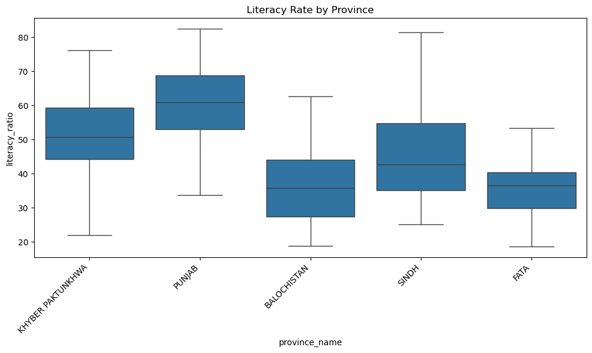
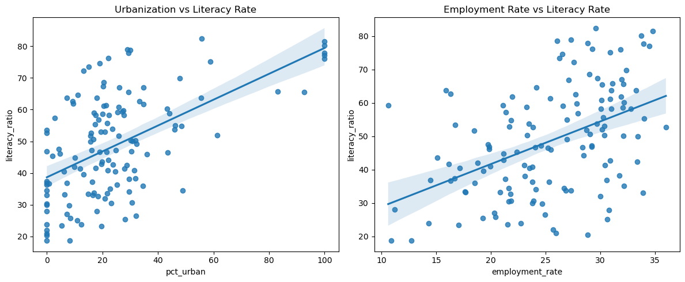
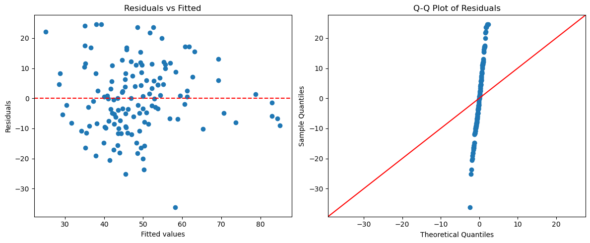
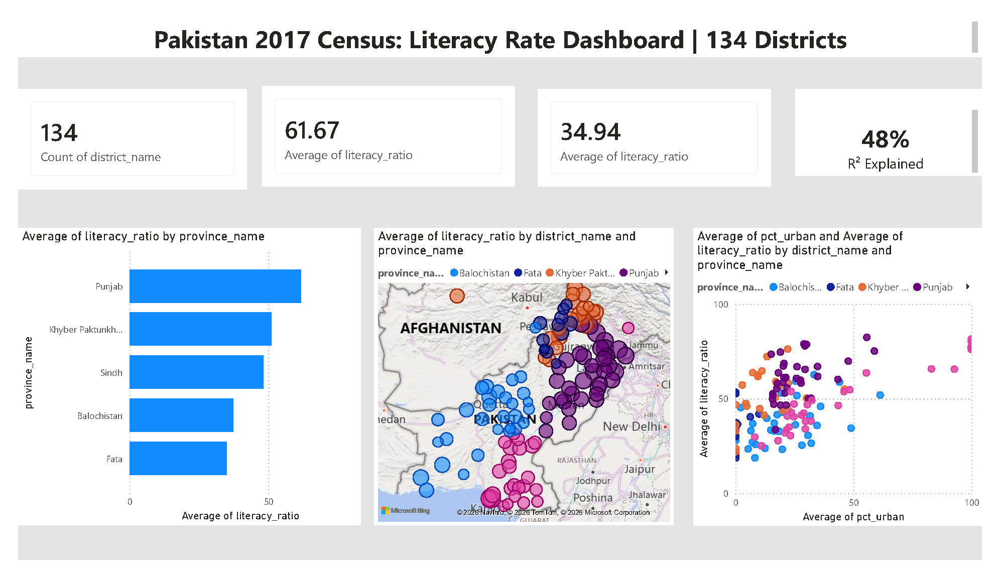

# Predicting District-Level Literacy Rates in Pakistan

A regression analysis using 2017 Pakistan Population Census data.

**Author:** Zohra | BS Statistics, University of the Punjab (CSAS)

## Overview

This project explores which district-level factors — urbanization, employment,
and housing quality — are associated with literacy rate across Pakistan's 134
districts, and whether literacy rate differs significantly by province.

**Methods:** OLS regression, VIF checks, residual diagnostics, influential
point analysis (Cook's distance), one-way ANOVA, and Tukey HSD post-hoc
testing.

**Key findings:**
1. Urbanization, employment rate, and housing quality (rooms per housing
   unit) are all significant, positive predictors of district literacy rate,
   together explaining ~48% of the variation.
2. The model shows no multicollinearity issues and passes residual
   diagnostic checks; its conclusions are robust to the most influential
   outlier (Kohistan District, Cook's D = 0.258).
3. Provinces differ significantly in literacy rate even beyond what these
   factors explain — Punjab leads, Balochistan and FATA lag, and
   Khyber Pakhtunkhwa/Sindh sit in between.

**Limitations:**
- Cross-sectional data (2017 only) — no time trend
- ~52% of the variation in literacy rate is unexplained by this model;
  results describe association, not causation
- District-level aggregation masks within-district variation

## Data

Source: 2017 Pakistan Population Census, via
[colincookman/pakistan_census](https://github.com/colincookman/pakistan_census).

Place the following four CSV files in the `data/` folder before running the
notebook:

| File | Contents |
|---|---|
| `table_13_literacy.csv` | Literacy ratio by district, gender, and area type (target variable) |
| `population.csv` | Population, urbanization %, household size, density |
| `imployment data..csv` | Population by employment/activity status |
| `housing data.csv` | Housing unit size and room counts |

These files are not included in this repository — download them from the
source above.

## Project structure

```
literacy-rate-prediction/
├── literacy_prediction.ipynb   # Full analysis
├── images/                     # Plots referenced in this README
├── data/                       # Place source CSVs here (gitignored)
├── requirements.txt
├── LICENSE
└── README.md
```

## Setup

```bash
git clone <this-repo-url>
cd literacy-rate-prediction
pip install -r requirements.txt
```

Then place the four census CSVs in `data/` and open
`literacy_prediction.ipynb`.

## Results





## DashBoard



